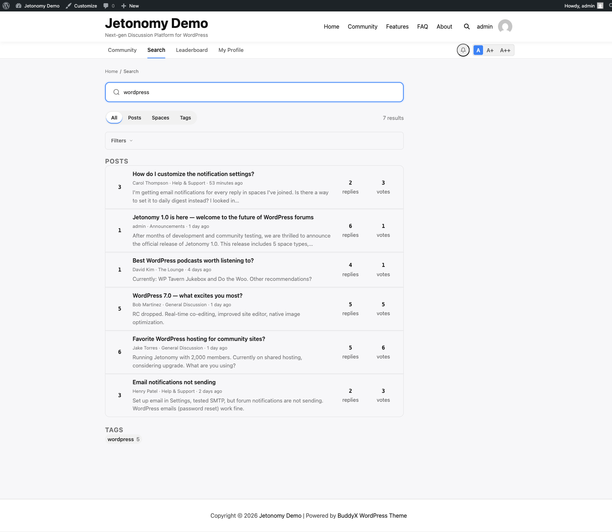

Jetonomy's search finds content across your entire community in real time - topics, replies, spaces, and tags - and lets you narrow results with powerful filters so members always land on exactly what they need.

## What You Will Learn

- How to run a full-text search from anywhere in the community
- What the filter pills do and how to use them
- How advanced filters refine results by date, author, tag, and sort order
- How to show and hide the filter bar
- How developers can extend search filters with a custom hook

## Running a Search

The search bar sits in the community navigation, visible on every page. Type any keyword and press Enter or click the search icon. Jetonomy searches across:

- Topic titles and content
- Space names and descriptions
- Tag names

Results appear on the search results page at `/community/search/`. Each result card shows the content type, the space it belongs to, the author, the date, and a short excerpt with your search term highlighted.



> **Tip:** Every word you type is required (AND), matched as a prefix - searching `email digest` finds posts containing both `email...` and `digest...`. Short words (under 4 characters) are ignored, so lead with the distinctive terms.

## Filter Pills

At the top of the results page, four filter pills let you narrow by content type instantly:

| Pill | Shows |
|------|-------|
| All | Every matching result |
| Posts | Topic results only |
| Spaces | Space results only |
| Tags | Tag results only |

Click any pill to filter. The URL updates so you can share a filtered search link with your team.

## Advanced Filters

Click the **Filters** disclosure to expand the advanced filter bar. It auto-expands whenever any filter is already active. These filters stack - you can combine them in any combination.

### Date Range

Set a **Date from** and / or **Date to** date to restrict results to a window. Jetonomy filters by the post's original publish date, not its last reply date.

### Author

Type a name or username to filter results to a specific author. Jetonomy resolves it to the matching member when you submit the search (there is no live typeahead). This is useful for reviewing a particular member's contributions or finding your own older posts.

### Tag

Type a tag name to restrict results to posts that carry that tag. Combining author and tag filters is a fast way to find all posts by a specific member on a specific topic.

### Sort Order

| Option | Orders by |
|--------|-----------|
| Relevance | Full-text match score (default) |
| Newest | Most recently published first |
| Most Voted | Highest net vote score first |

Relevance is the default because it surfaces the best textual match. Switch to Newest when you know you are looking for a recent discussion. Switch to Most Voted when you want the community's highest-rated answer on a topic.

### Collapsing the Filter Bar

Click **Filters** again to collapse the bar. Your active filters remain applied even while the bar is collapsed.

## For Developers: Extending Search Filters

To modify the search query itself, use the `jetonomy_search_query_args` filter. It receives the assembled query arguments (`q`, `space_id`, `date_from`, `date_to`, `author_id`, `tag_slug`, `sort`) and must return the array.

```php
add_filter( 'jetonomy_search_query_args', function( $args ) {
    // Restrict the query to a specific space.
    if ( ! empty( $_GET['space_id'] ) ) {
        $args['space_id'] = absint( $_GET['space_id'] );
    }
    return $args;
} );
```

To render extra controls in the filter bar, hook the `jetonomy_search_filters` action. It is a `do_action` (it returns nothing) fired just after the filter form, with three arguments: the query string `$q`, the active `$filter` pill, and an array of the current filter values.

```php
add_action( 'jetonomy_search_filters', function( $q, $filter, $filters ) {
    // Echo your own markup for an extra filter control here.
}, 10, 3 );
```

See the [Hooks Reference](../developer-guide/02-hooks-reference.md) for the full parameter list.

## What's Next?

Learn how tags work across spaces and how members can browse tag pages to find related content.

[Tags →](02-tags.md)

## Related Pro Features

- [SEO Pro](../pro-features/14-seo-pro.md) - per-space meta, schema.org markup, OG/Twitter cards, and sitemaps so search engines surface your community.
