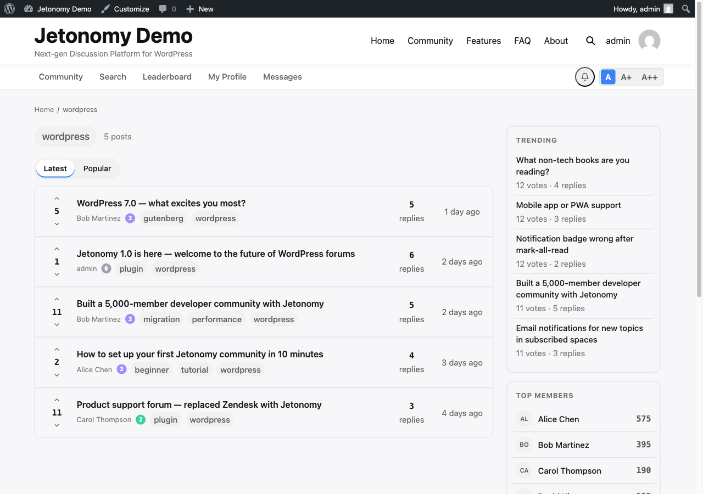

Tags connect related discussions across your entire community. A member searching for help with "payments" can click the payments tag and instantly see every relevant topic - no matter which space it lives in.



## What You Will Learn

- How to add tags when creating a topic
- How tag pills work on topic listings
- How tag pages bring together content from multiple spaces
- How the Popular Tags sidebar section helps members discover content
- Why consistent tagging improves search and community quality

## Adding Tags to a Topic

When creating or editing a topic, the **Tags** field appears below the content editor. Type one or more tag names separated by commas - for example `python, django, architecture`.

Reuse existing tag names whenever possible - reusing tags makes the tag page more useful for everyone who follows that topic, and matching an existing name (rather than a typo) keeps related posts together.

> **Tip:** In Q&A spaces, good tags are the fastest route to an answer. A question tagged with "payments" and "stripe" will appear on both tag pages, doubling its chance of being seen by someone who can help.

## Tag Pills on Topic Listings

Every topic card in a space listing shows its tags as small pills below the title. Clicking a tag pill takes you directly to that tag's page - you do not leave the flow to reach it.

Tags in listings are a fast way to browse by topic without running a search. If a space covers multiple subjects, tag pills help members navigate without scrolling through unrelated posts.

## Tag Pages

Every tag has a dedicated page at `/community/tag/tag-slug/`. The tag page shows all published topics across all spaces that carry that tag, sorted by **Latest** (newest first) by default.

Members can switch the sort to **Popular** to find the best content on that topic - Popular orders by net vote score.

Tag pages are publicly accessible by default. If your community is private, tag pages respect the space access rules - topics in private spaces are not shown on tag pages to members who do not have access to those spaces.

## Popular Tags Sidebar

The **Popular Tags** section in the community sidebar lists the most frequently used tags across your community (up to 15), each linking to its tag page with a post count. It appears automatically - there is nothing to configure.

Developers can hide it with the `jetonomy_show_sidebar_popular_tags` filter:

```php
add_filter( 'jetonomy_show_sidebar_popular_tags', '__return_false' );
```

## How Tags Improve Your Community

Tags work across space boundaries. A tag named "onboarding" can tie together a tutorial in your Guides space, a question in your Q&A space, and a feature idea in your Ideas space. Members following that tag see the full picture regardless of which space each post lives in.

Encouraging consistent tag use - especially in high-traffic spaces - pays dividends in search quality. Jetonomy's full-text search treats tags as a search signal, so well-tagged posts surface higher in relevant queries.

> **Note:** Tags are shared across all spaces. There is one global tag namespace. A tag created in your Support space appears on the same tag page as the same tag used in your Ideas space.

## Admin Tag Management

Members create tags on the fly as they post, but admins get a dedicated management screen for the whole global tag namespace at **Jetonomy → Tags** in the WordPress admin. Managing tags here requires the `jetonomy_manage_settings` capability.

The page lists every tag with its post count and gives you these controls:

| Action | What it does |
|--------|-------------|
| Add New Tag | Create a tag directly from the admin (name, optional slug) without having to post first |
| Edit | Rename a tag or change its slug. The change applies everywhere the tag is used |
| Delete | Remove a single tag. You can force-delete a tag even when posts are still attached to it |
| Bulk Delete | Tick multiple tags, choose **Delete** from the bulk-action dropdown, and click **Apply** to clear several at once |

The list also has a search box and a per-page picker, and it paginates so it stays fast even on communities with thousands of tags.

Use this screen to clean up duplicate or misspelled tags (for example merging "stripe" and "Stripe" by deleting the stray one), retire tags that are no longer relevant, or pre-create the canonical tags you want members to reuse. Because the namespace is global, an edit or delete here affects every space at once.

## What's Next?

Learn how Jetonomy's trust system automatically identifies your most reliable members and gives them more capabilities over time.

[Trust Levels & Reputation →](../moderation-and-trust/01-trust-levels.md)
