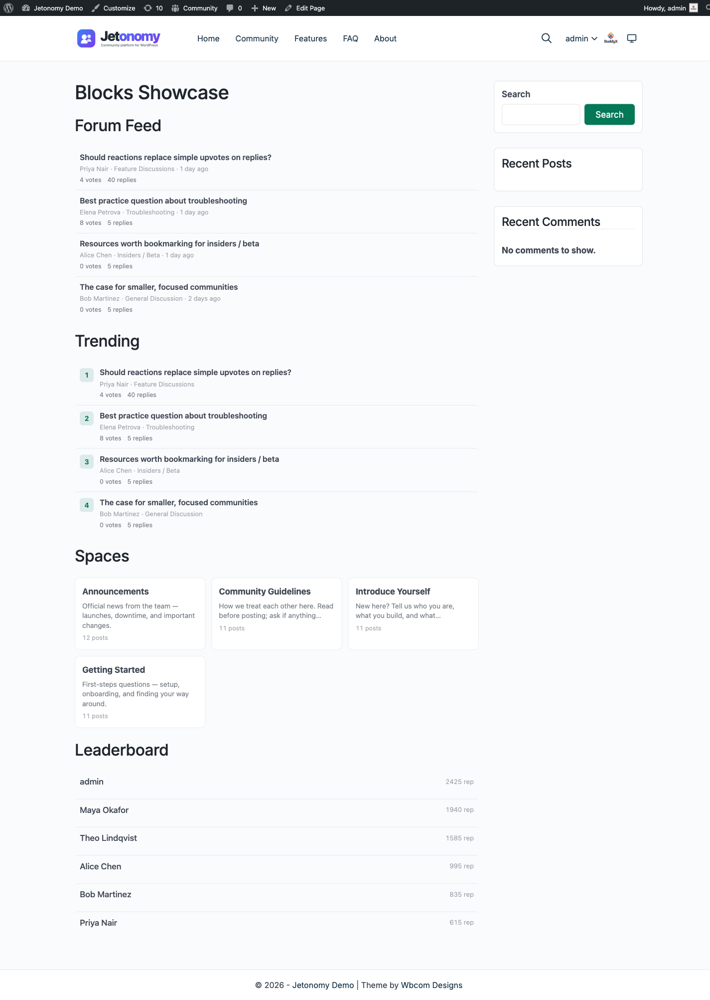

Trending surfaces the discussions that are catching fire right now, so members always see what the community is talking about today - not just the all-time greatest hits. It is one of the three ways members discover content in Jetonomy, alongside [search](01-search-filters.md) and [tags](02-tags.md).



## What You Will Learn

- Where members see trending content out of the box
- How trending is calculated (recent engagement, not lifetime score)
- How to surface a trending list anywhere on your site with the Trending block or shortcode
- How to scope trending to a single space and change the time window

## Where Members See Trending

Two trending surfaces ship with Jetonomy, and they answer slightly different questions.

### The sidebar Trending widget (automatic)

Every community page shows a **Trending** card in the sidebar with the top five topics. It appears automatically - there is nothing to configure. When a member is viewing a space, the card shows that space's top topics; everywhere else it shows the community-wide top topics. This card ranks by net votes (then reply count) and respects privacy, so private topics never leak to members who cannot access them.

### The Trending block and shortcode (you place it)

When you want a "what's hot this week" list on a landing page, the community home, or any WordPress page or post, use the **Trending Topics** block or the `[jetonomy_trending_posts]` shortcode. Unlike the sidebar card, this list ranks by a time-decayed *hot score* so genuinely active recent discussions rise to the top instead of old topics that simply accumulated a lot of votes over time.

## How Trending Is Calculated

The Trending block and shortcode score each topic on **recent engagement**, not its lifetime total. A topic's hot score combines its votes and replies, then decays as the topic ages, so a discussion that picked up ten replies yesterday outranks one that collected the same activity months ago. Only topics published within the time window (7 days by default) are considered.

This is by design: trending is meant to answer "what is the community talking about *right now*", which is exactly what brings members back day after day.

## Placing a Trending List on a Page

### Using the block

1. Edit any page or post in the WordPress block editor.
2. Click the **+** inserter and search for **Trending Topics**.
3. Drop the block in. It renders a live, ranked list of hot topics with rank numbers.
4. Adjust the block settings in the sidebar - number of topics, a specific space, the time window, and whether to show the header.

### Using the shortcode

Paste `[jetonomy_trending_posts]` into any page, post, or text widget. The block and the shortcode share the same render path, so you get identical output either way - use whichever fits your page builder.

```text
[jetonomy_trending_posts count="10" window="14"]
```

### Attributes

| Block setting | Shortcode attribute | What it does | Default |
|---------------|--------------------|--------------|---------|
| Number of topics | `count` | How many topics to list | 5 |
| Space | `space_id` | Limit trending to a single space (`0` = whole community) | 0 (all spaces) |
| Time window | `window` | How many recent days to score, in days | 7 |
| Show header | `showHeader` *(block only)* | Show or hide the "Trending" heading | On |

If there are no qualifying topics in the window yet, the block shows a friendly "No trending discussions yet" message rather than an empty box.

## What's Next?

Learn how Jetonomy's trust system automatically identifies your most reliable members and gives them more capabilities over time.

[Trust Levels & Reputation →](../moderation-and-trust/01-trust-levels.md)

## For Developers

- Block name: `jetonomy/trending`. Shortcode: `[jetonomy_trending_posts]`. Both call the same render path, so block/shortcode output is identical.
- The hot score is computed in `Post::list_trending( $limit, $space_id, $window_days )`.
- The sidebar Trending card can be hidden with the `jetonomy_show_sidebar_trending` filter, and you can inject markup around it with the `jetonomy_sidebar_before_trending` / `jetonomy_sidebar_after_trending` action hooks (each receives the current `$space` or `null`). See the [Blocks & Shortcodes reference](../developer-guide/04-shortcodes-widgets-blocks.md) and the [Hooks Reference](../developer-guide/02-hooks-reference.md).
