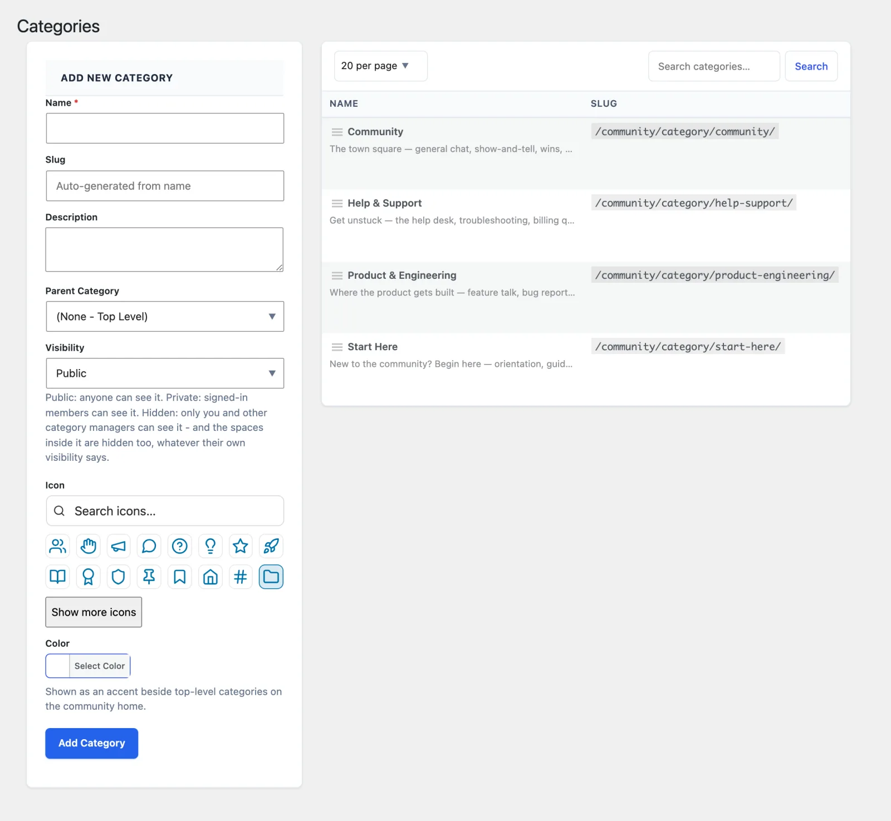

Categories are the top-level groupings members see on your community home page - think of them as the tabs or sections that organize your spaces. Every space belongs to a category, so it makes sense to set up your categories first, then create spaces inside them.

## What You Will Learn

- How categories relate to spaces (and why you set them up first)
- How to create, edit, delete, and reorder categories
- How category visibility works
- How icons and colors appear in navigation

## Categories vs Spaces

- A **category** is a label that groups related spaces together (for example "Support", "Community", or "Product").
- A **space** is the actual discussion area where members post topics and replies.

A space must be assigned to a category to appear in the community navigation. So the normal setup order is: create a category, then create one or more spaces inside it. See [Creating Spaces](01-creating-spaces.md) once your categories are ready.

## Where to Find It

Go to **Jetonomy → Categories** in your WordPress admin.

This screen is administrator-only by default - it requires the `jetonomy_manage_categories` capability, which is granted only to administrators by default. Editors and other roles do not see this page.

## Page Layout

The Categories screen is split into two panels side by side:

- **Left - Add New Category form** for creating a new category
- **Right - Categories table** listing existing categories and their children

## Creating a Category

Fill in the Add New Category form and click **Add Category**.

| Field | Required | What it does |
|---|---|---|
| Name | Yes | Shown in navigation and on the category page |
| Slug | No | Auto-generated from the name if left blank. Used in the URL. |
| Description | No | Optional text shown on the category listing page |
| Parent Category | No | Nest this category under an existing one. Two levels maximum. |
| Visibility | No | Controls who can see this category (see below) |
| Icon | No | Choose from the built-in Lucide icon picker |
| Color | No | A color swatch shown next to the category name in navigation |

### Visibility Options

| Option | Who can see the category |
|---|---|
| Public | All visitors, including logged-out visitors, when guest access is on |
| Private | Logged-in members only |
| Hidden | Not shown in navigation or listings, and its URL returns *not found* to anyone who cannot manage categories. Its spaces are hidden too (see below) |

A space is never more visible than its category:

- A space in a **Private** category is hidden from logged-out visitors, even if the space itself is Public.
- A space in a **Hidden** category is hidden from everyone except administrators and people already admitted to that space, meaning its members or people an access rule lets in. Anyone else who opens the space's address sees "Space not found."

A public category can still contain private or hidden spaces - each space keeps its own [visibility setting](03-membership-policies.md), and the stricter of the two applies.

## Editing a Category

Click **Edit** in the row actions under any category name. An **Edit Category** dialog opens with the same fields as the creation form. Make your changes and click **Update Category**.

## Deleting a Category

Click **Delete** in the row actions. A confirmation prompt appears before the delete runs.

> **Warning:** You cannot delete a category that still holds spaces or sub-categories. Jetonomy shows "Cannot delete a category that contains spaces. Move or delete the spaces first." Move the spaces to another category (or delete them) first. Archived spaces do not block the delete: they become "uncategorized." There is no undo.

## Reordering Categories

Drag the handle icon at the far left of any row to reorder categories. The new order saves automatically when you drop the row. Child categories follow their parent when the parent moves.

## Child Categories

Set **Parent Category** when creating or editing a category to nest it under an existing top-level category. The table shows children indented below their parent.

- **Two levels only.** A parent must be a top-level category, and a category that has sub-categories cannot become one itself. Jetonomy rejects anything deeper in wp-admin, the REST API and WP-CLI. Imports (for example nested bbPress forums) attach deeper levels to their top-level category, so every space still arrives.
- **On the community home,** each category lists its own spaces followed by its sub-categories as links, with how many spaces each one holds. A sub-category page shows its parent in the breadcrumb.
- **Deleting** a category is blocked while it still has sub-categories or spaces that are not archived (locked spaces count). Move or delete them first. Archived spaces in it become uncategorised.
- **Space counts** on a category count the spaces filed directly in it, not those in its sub-categories.

## Search

Use the search box in the table toolbar to filter categories by name. Clear the search to see all categories again. Searching does not affect the Add New Category form.

## Rows Per Page

The dropdown in the table toolbar controls how many categories appear per page (20, 50, or 100). The list refreshes as soon as you change the selection - useful once you have a large number of categories.

## What's Next?

Now that your categories are set up, create the spaces members will actually post in.

[Creating Spaces →](01-creating-spaces.md)
