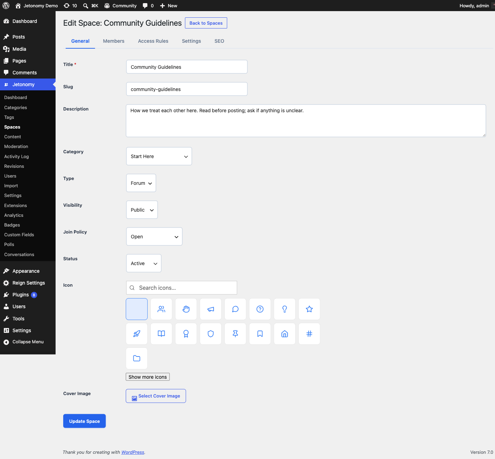

Spaces are the discussion areas inside your community - each one has its own topic listing, member list, and settings. This guide shows you how to create, configure, and manage them.

## What You Will Learn

- What spaces are and how they relate to categories
- Every field on the space creation form
- How the space header looks on the frontend
- How to edit and archive an existing space

## What Is a Space?

A space is a focused discussion area organized around a single topic or purpose. Examples: a "General Discussion" space, a "Product Feedback" space, a "Help & Support" space.

Every space belongs to a category. Categories are the top-level groupings (like tabs or sections) that members see on the community home page. A space without a category will not appear in the community navigation.

> **Tip:** Plan your space structure before creating anything. Too many spaces fragment your community early. Start with three to five and add more as demand grows.

## Creating a Space

Go to **Jetonomy → Spaces** in your WordPress admin and click **Add New Space**.

### Basic Information

**Title** - The name members see in listings, the space header, and breadcrumbs. Keep it short and descriptive.

**Slug** - The URL-safe identifier for this space. Jetonomy auto-generates a slug from the title. The final URL will be `/community/s/your-slug/`. You can change the slug, but doing so after posts exist will break any existing links.

**Description** - A short sentence or two explaining what this space is for. This appears in the space header below the title and in category listing cards. It also populates the meta description for search engines.

**Icon** - A single emoji that represents the space. It appears in the space header and on category listing cards alongside the title. Choose something that works in monochrome - it will be displayed at small sizes on mobile.

**Category** - Select which category this space belongs to. A space must be assigned to a category to appear on the community home page.

### Space Configuration

**Type** - Choose Forum, Q&A, or Ideas. This controls how posts and replies behave. See [Space Types](02-space-types.md) for a full explanation of each.

**Visibility** - Controls who can see the space and its content. Options: Public, Private, or Hidden. See [Membership & Join Policies](03-membership-policies.md) for details.

**Join Policy** - Controls how members gain access. Options: Open, Approval Required, or Invite Only.

Click **Save Space** to publish it immediately.

## The Space Header (Frontend)

Every space has a header at the top of `/community/s/your-slug/` showing:

- The emoji icon at large size
- The space title and description
- A stat bar with total post count, member count, and last activity time
- A **Follow** button for logged-in users (subscribes them to new post notifications)
- A **Join** button when the space requires membership

Members who have already joined see the Join button replaced with their role badge (Member, Moderator, or Admin).

## Editing a Space

Go to **Jetonomy → Spaces**, find the space in the list, and click **Edit**. All fields are editable, including the type and visibility settings.

> **Note:** Changing the space type after content exists does not reformat old posts. Existing posts keep their original structure. Only new posts use the new type's behavior.

## Archiving a Space

To archive a space, open it for editing and set its **Status** to **Archived**. An archived space becomes read-only - members can read existing posts and replies, but cannot create new ones. The space remains visible in listings with a clear "Archived" label.

Archived spaces do not count toward activity stats on the community home page.

To permanently remove a space, click **Delete** in the space list. This action also deletes all posts, replies, votes, and member records inside that space. It cannot be undone.

## What's Next?

Learn how each space type changes the way posts and replies behave.

[Space Types →](02-space-types.md)
