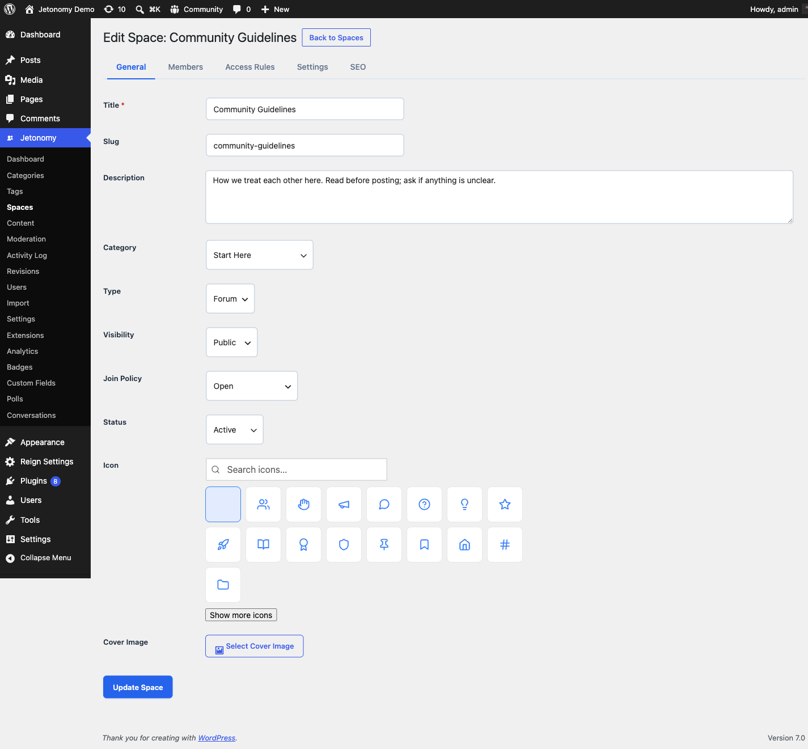

Spaces are the discussion areas inside your community - each one has its own topic listing, member list, and settings. This guide shows you how to create, configure, and manage them.

## What You Will Learn

- What spaces are and how they relate to categories
- Every field on the space creation form
- How the space header looks on the frontend
- How to edit and archive an existing space

## What Is a Space?

A space is a focused discussion area organized around a single topic or purpose. Examples: a "General Discussion" space, a "Product Feedback" space, a "Help & Support" space.

Every space belongs to a category. Categories are the top-level groupings (like tabs or sections) that members see on the community home page. A space without a category will not appear in the community navigation, so set your categories up first. See [Categories](00-categories.md) for how to create and organize them.

> **Tip:** Plan your space structure before creating anything. Too many spaces fragment your community early. Start with three to five and add more as demand grows.

## Creating a Space

You have two ways to create a space, depending on who needs to do it:

- **wp-admin path (admins):** Go to **Jetonomy → Spaces** in your WordPress dashboard and click **Add New Space**.
- **Front-end path (anyone you choose):** Visit `/community/new-space/` while signed in. This page is available to any user role you've allowed under **Settings → Front-end space creation**, so you can let space owners or moderators create spaces without giving them wp-admin access. See [Creating Spaces From the Front End](07-front-end-create-space.md) for the full walkthrough.

Both paths show the same fields and produce the same result. The rest of this section describes each field.

### Basic Information

**Title** - The name members see in listings, the space header, and breadcrumbs. Keep it short and descriptive.

**Slug** - The URL-safe identifier for this space. Jetonomy auto-generates a slug from the title. The final URL will be `/community/s/your-slug/`. You can change the slug, but doing so after posts exist will break any existing links.

**Description** - A short sentence or two explaining what this space is for. This appears in the space header below the title and in category listing cards. It also populates the meta description for search engines.

**Icon** - The space icon is selected from Jetonomy's built-in Lucide icon picker (16 default icons plus 8 extras revealed by the "Show more" button, plus a search field to find any other Lucide name). The chosen icon appears in the space header and on category listing cards alongside the title. Icons render as crisp SVGs at every size, so they read clearly on mobile.

**Category** - Select which category this space belongs to. A space must be assigned to a category to appear on the community home page.

### Space Configuration

**Type** - Choose Forum, Q&A, or Ideas. This controls how posts and replies behave. See [Space Types](02-space-types.md) for a full explanation of each.

**Visibility** - Controls who can see the space and its content. Options: Public, Private, or Hidden. See [Membership & Join Policies](03-membership-policies.md) for details.

**Join Policy** - Controls how members gain access. Options: Open, Approval Required, or Invite Only.

> **Defaults:** if you leave Visibility and Join Policy untouched, a new space is **Public + Open** - anyone can find, read, and join it. Change them for private or invite-only spaces. Note that Hidden visibility always forces Invite Only; see [Membership & Join Policies](03-membership-policies.md).

Click **Save Space** to publish it immediately.

## The Space Header (Frontend)

Every space has a header at the top of `/community/s/your-slug/` showing:

- The Lucide icon at large size
- The space title and description
- A stat bar with total post count, member count, and last activity time
- A **Follow** button for logged-in users (subscribes them to new post notifications)
- A **Join** button when the space requires membership

Members who have already joined see the Join button replaced with their role badge (Member, Moderator, or Admin).

## Editing a Space

Two paths, same fields:

- **wp-admin:** Go to **Jetonomy → Spaces**, find the space in the list, and click **Edit**.
- **Front end:** Visit the space at `/community/s/your-slug/` while signed in as a space owner / moderator and click the **Edit space** button in the space header. See [Editing Spaces From the Front End](08-front-end-edit-space.md) for screenshots.

All fields are editable from either path, including the type and visibility settings.

> **Note:** Changing the space type after content exists does not reformat old posts. Existing posts keep their original structure. Only new posts use the new type's behavior.

## Archiving a Space

To archive a space, open it for editing and set its **Status** to **Archived**. An archived space becomes read-only - members can read existing posts and replies, but cannot create new ones. The space remains visible in listings with a clear "Archived" label.

Archived spaces do not count toward activity stats on the community home page.

## Removing a Space

A space holds other members' topics and replies, not just the owner's, so removing one defaults to keeping that content rather than destroying it. The space list offers two separate actions.

**Archive** hands the space to an administrator and sets it to read-only. Every topic, reply and vote is kept, and members can still read the space. Nothing is deleted, and you can set the space back to Active at any time. This is what you want in almost every case.

**Delete permanently** destroys the space and everything inside it - every topic, every reply, every attachment, every member record - including content written by other members. This cannot be undone.

> **Who sees "Delete permanently".** Site administrators always do. Space admins only see it if you have turned on **Settings → Members → Let space admins permanently delete a space and everything in it**, which is off by default. If it is off, a space admin can archive a space but not destroy it.

On a large space, permanent deletion runs in the background and can take a few minutes to finish. The space stays visible until the last of its content is removed, so an interrupted deletion resumes rather than leaving the community in a half-deleted state.

> **Changed in 1.9.3.** Deleting a space previously removed the space itself but left its topics, replies and member records behind as unreachable rows in the database. Both actions above now handle a space's contents properly. If you deleted spaces on an earlier version, Jetonomy cleans up what those deletions left behind automatically in the background.

## What's Next?

Learn how each space type changes the way posts and replies behave.

[Space Types →](02-space-types.md)
