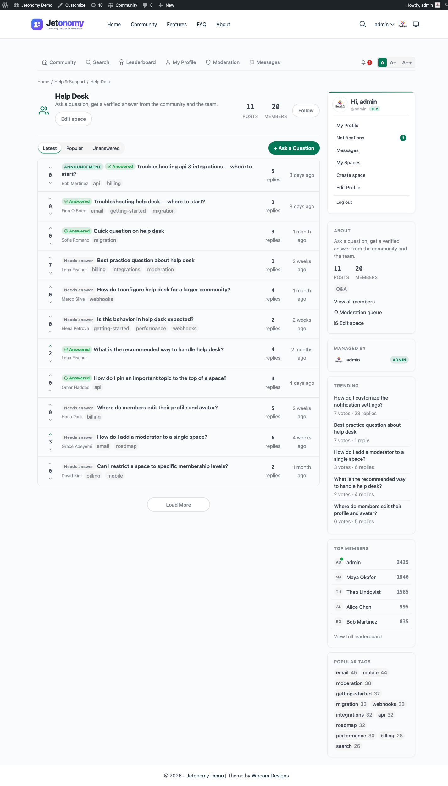

The space type you choose determines how posts are structured, how replies work, and what extra features appear. Pick the right type and your community will feel purpose-built - pick the wrong one and members will feel like they are fighting the interface.

## What You Will Learn

- What each space type is designed for
- How posts and replies behave differently per type
- The unique features each type unlocks
- How to change a space type after creation

## The Four Space Types

### Forum

Forum is the default type. It is the right choice for general discussion, support, announcements, or any conversation without a single "correct" answer.

**How it works:**

- Members post a topic with a title and rich content.
- Replies thread up to three levels deep (reply to a reply to a reply).
- Votes on replies surface the best contributions via the Best sort, but no reply is formally "accepted."
- Topics can be sorted by Newest, Oldest, or Best on the space listing page.

Use Forum for: support channels, general discussion, community announcements, staff Q&A sessions.

### Q&A

Q&A is built for questions that have a definitive best answer. It follows the model made popular by Stack Overflow. The person who asked the question marks one reply as the accepted answer.

**How it works:**

- Every post is a question. The title should be phrased as a question.
- Replies are answers. Each answer is voted on independently.
- The post author sees an **Accept** button on every reply. Clicking it marks that reply as the accepted answer and pins it to the top of the reply list, regardless of sort order.
- The accepted answer author earns a reputation bonus (+15 points).
- The post listing shows an "Answered" badge on topics with an accepted answer. This badge also appears on the space list so members can see at a glance which Q&A spaces have resolved questions.

Use Q&A for: help & support, how-to guides, technical documentation requests, troubleshooting.

> **Tip:** The Unanswered filter on the space listing page shows only topics with no accepted answer. This is a powerful tool for community moderators and support teams tracking open questions.

### Ideas

Ideas is built for feature requests, product feedback, and roadmap voting. Each idea has a status that you control, and members vote to indicate demand.

**How it works:**

- Members submit ideas with a title and description.
- Other members upvote (or downvote) to signal interest. Vote score drives the default sort order.
- Each idea has an **Idea Status** that the space moderator or admin updates manually:

| Status | Meaning |
|--------|---------|
| Planned | On the roadmap |
| In Progress | Being built right now |
| Shipped | Completed and available |
| Declined | Will not be implemented |

- Status updates appear in the reply thread as a system activity entry, so members can see when an idea's status changed.
- The space listing page has a filter bar showing counts per status, making it easy to browse the roadmap.

Use Ideas for: product feedback boards, feature request trackers, community roadmaps, vote-to-prioritize workflows.

For a full guide to the Ideas roadmap view, see [Ideas Roadmap](06-ideas-roadmap.md).

> **Tip:** Pick the `lightbulb` icon from the Lucide icon picker and name the space something like "Ideas & Feedback" to set the right expectation before members click through.

### Feed

Feed is designed for short-form status updates - brief posts without a required title. Posts render as feed cards rather than the row list used by Forum and Q&A, so it behaves more like an activity stream than a traditional forum.

**How it works:**

- The post title field is optional. Members can post a standalone message, image, or link.
- Posts appear in a card-style feed sorted chronologically by default.
- Replies work the same as Forum type, threaded up to three levels deep.
- Voting is available, but the feed sort does not default to Best - it defaults to Latest.

Use Feed for: member introductions, community announcements, daily check-ins, showcasing work, open-ended community updates.

## Changing the Space Type

You can change the type of an existing space at any time. Either open it in **Jetonomy → Spaces** in wp-admin, or use the **Edit space** button on the space header itself (front-end edit), and update the **Type** field.

The change takes effect immediately for all new posts. Existing posts keep their original structure. A Q&A post does not lose its accepted answer, and an Ideas post does not lose its status history.

If you change a Q&A space to Forum, the Accept button disappears from the UI but existing accepted answers remain stored in the database.

## What's Next?

Learn how to control who can see your spaces and how members join them.

[Membership & Join Policies →](03-membership-policies.md)
