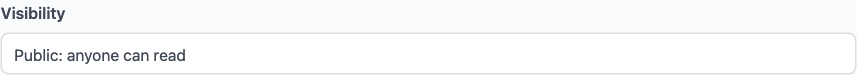

Every space has two controls: who can see it (visibility) and how members get in (join policy). Combining them gives you precise control over every access scenario - from fully public forums to invite-only private communities. The two controls are independent in every combination except one: a Hidden space is always Invite Only (see the note under Hidden below).

## What You Will Learn

- The three visibility levels and when to use each
- The three join policies and how they differ
- Per-space posting restrictions
- Space member roles and what each can do
- How to combine visibility and join policy for common use cases

> **What you get if you leave the defaults alone:** a new space is **Public** visibility with an **Open** join policy unless you change it (or unless you have changed the community-wide default under **Jetonomy → Settings**). That means anyone can find, read, and join the space with no approval - the most open setting. Tighten it from there for private or invite-only communities.

## Visibility Levels

Visibility controls whether the space appears in listings and whether non-members can read its content.

### Public

The space appears on the community home page, in search results, and in category listings. Any visitor - including users who are not logged in - can read all posts and replies.

Members still need to join (or be approved) before they can post or reply, depending on your join policy.

Use Public when you want maximum reach and SEO value. Most community spaces should start here.

### Private

The space appears in listings and search results, so members can discover it. However, only approved members can read the content. Non-members see the space name and description, then a "Request to Join" prompt.

Use Private for paid membership communities, internal team discussions, or beta program spaces where content should be gated but the space itself should be findable.

### Hidden

The space does not appear in any listing, search result, or category navigation. Only members who have already joined - and admins - can see it.

Members can only reach a hidden space via a direct link or an invite link you share with them.

Use Hidden for admin-only spaces, private moderator discussion boards, or early access groups where you control every invitation.

> **Hidden spaces are always Invite Only.** Because a Hidden space has no public Join button, its join policy is locked to Invite Only - members can only enter through an [invite link](#invite-only) you share. If you pick Hidden in wp-admin, the join policy is switched to Invite Only for you automatically (and if you set a Hidden space back to Open or Approval Required, the visibility drops to Private). From the front-end create/edit form or the REST API, the same combination is rejected on save with the message "Hidden spaces must use the invite-only join policy" - so always pair Hidden with Invite Only.

> **Note:** WP Admins and space admins can always see hidden spaces in the admin panel, regardless of their membership status.

## Join Policies

Join policy controls how members gain access to the space. It works in combination with visibility.

### Open

Any logged-in user can join instantly by clicking the **Join** button on the space header. There is no approval step.

Members who join an Open space can post and reply immediately (subject to your per-space posting restrictions).

Use Open for general discussion spaces, community-wide help channels, and any space where you want minimal friction.

### Approval Required

When a user clicks **Join**, they submit a join request. The request goes to the space moderators and admins for review.

Moderators see pending requests in **Jetonomy → Moderation → Join Requests**. They can approve or decline each request. The user gets a notification when their request is reviewed.

Approved members can then post and reply immediately.

Use Approval Required when you want to vet members before they can participate - for example, a verified customer support channel or a professional community with admission criteria.

### Invite Only

No join button is shown to non-members. Members can only enter via an invite link generated by a space moderator or admin.

To create an invite link, open the space in the admin panel (**Jetonomy → Spaces → [space] → Edit**) and go to the **Invite Links** section. Each link has a configurable usage limit and optional expiry date. You can see how many times each link has been used.

> **Invite links are created in wp-admin.** Invite-link management lives on the wp-admin space edit screen, not on the front-end editor. A front-end space owner who does not have wp-admin access can still run an Invite Only space, but a site administrator (or someone with wp-admin access) generates and shares the links for them. The front-end Edit Space page can set the join policy to Invite Only but does not create the links themselves.

Anyone who visits a valid invite link is automatically added as a member - no approval step required.

Use Invite Only for private groups, course cohorts, or closed communities where every member should be explicitly invited.

## Per-Space Posting Restrictions

Beyond join policy, each space has two additional settings that control what members can do once inside:

**Who Can Post** - Controls who can create new topics in this space.

| Setting | Effect |
|---------|--------|
| (Use Global Default) | Falls back to the community-wide Who Can Post setting |
| Members Only | All members of the space can post |
| Moderators & Admins | Only space moderators and admins can post |
| Admins Only | Only space admins (and site admins) can post |

**Who Can Reply** - Controls who can reply to existing topics.

| Setting | Effect |
|---------|--------|
| (Use Global Default) | Falls back to the community-wide Who Can Reply setting |
| Members Only | All members of the space can reply |
| Moderators & Admins | Only space moderators and admins can reply |

These settings let you create announcement-only spaces (post set to Moderators & Admins, reply set to Moderators & Admins), or read-heavy Q&A spaces where only trusted members can contribute.

## Space Member Roles

Every member of a space has one of three roles:

**Member** - Can read, post, and reply within the space's configured restrictions. Can vote, follow, and bookmark topics.

**Moderator** - All member abilities plus: approve pending posts, pin topics, close topics, move topics, delete posts and replies, manage join requests, create invite links, and review flagged content within the space.

**Admin** - All moderator abilities plus: change space settings, assign moderator and admin roles to other members, manage access rules, and archive or delete the space.

> **Note:** WordPress site admins can perform all admin-level actions on any space, regardless of their space role.

### Promoting members from the front-end (1.3.8+)

Space admins (and site admins) can change a member's space role directly from the front-end members page at `/community/s/:slug/members/`. Each member row carries a role dropdown; picking a new role saves the change live with inline success or error feedback. There is no wp-admin round-trip to add a moderator and no separate settings screen to open.

The dropdown is hidden for members who cannot manage roles, and a member cannot demote themselves below the level needed to keep at least one space admin. Members visible in the list still have to be members of the space to be assigned a role; the same per-space role rules listed above apply.

## Common Visibility + Join Policy Combinations

| Goal | Visibility | Join Policy |
|------|------------|-------------|
| Public community forum | Public | Open |
| Paid membership forum | Private | Approval Required |
| Team-only internal channel | Hidden | Invite Only |
| Verified customer support | Public | Approval Required |
| Early access beta group | Hidden | Invite Only |
| Course community | Private | Open (link-gated via Invite Only) |

## What's Next?

See every per-space setting in one place, including how they override global defaults.

[Space Settings →](04-space-settings.md)
