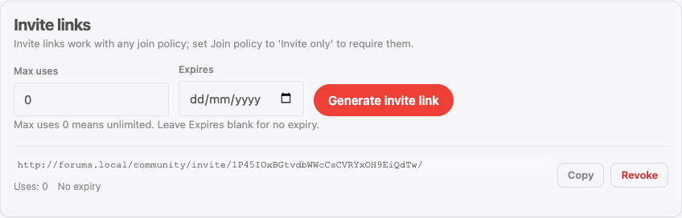

Each space can override the global Jetonomy defaults with its own settings. This page is a complete reference for every per-space option, how it interacts with global settings, and how invite links work.


## What You Will Learn

- Every per-space setting and what it controls
- How per-space settings override global defaults
- How to require moderator approval before posts go live
- How to create, share, and track invite links

## Accessing Space Settings

Go to **Jetonomy → Spaces** in your WordPress admin, find the space, and click **Edit**. The settings panel is on the right side of the edit screen.

## Per-Space Settings Reference

### Posts Per Page

**Default:** Inherits from global setting (default: 20)

Overrides how many topics appear per page on this space's listing. Set a lower number for low-traffic spaces with long post titles. Set a higher number for high-activity spaces where members scan quickly.

Valid range: 5 to 100.

### Require Post Approval

**Default:** Off

When enabled, every new post submitted by a non-moderator is held in a pending state and does not appear publicly until a moderator approves it.

Moderators and space admins can see pending posts immediately in the space listing with a "Pending" label. They can approve, reject, or mark the post as spam from the topic view or from **Jetonomy → Moderation**.

The post author receives a notification when their post is approved or rejected.

> **Tip:** Enable this for your early community days when you want to review every submission, then turn it off once you trust your membership base.

### Allow Voting

**Default:** On (inherits from global)

Controls whether upvote and downvote buttons appear on posts and replies in this space. Disabling voting also removes vote scores from the space's topic listing.

In Q&A spaces, voting is always available on replies regardless of this setting - otherwise the Best sort and accepted-answer workflow cannot function correctly.

In Ideas spaces, voting cannot be disabled because it is the core mechanism for prioritizing ideas.

### Who Can Post

**Default:** Anyone (members)

See [Membership & Join Policies](03-membership-policies.md) for the full option set. The per-space value overrides the global default for this space only.

### Who Can Reply

**Default:** Anyone (members)

Controls who can add replies to topics in this space. Overrides the global default for this space only.

### Post Prefixes

**Default:** Off

Prefixes are short, colored labels members can attach to the front of a topic title - for example "Bug", "Idea", "Solved", or "Announcement" - so the listing is easier to scan.

Turn on the **Enable prefixes** toggle to reveal the prefix list, then add one row per prefix. Each row has a **label** (up to 50 characters) and a **color** swatch. Add as many as the space needs, and remove any with the &times; button.

Once prefixes are enabled:

- When a member starts a new topic in the space, an optional **Prefix** dropdown appears on the compose form. They pick one (or leave it blank).
- The chosen prefix shows as a colored label in front of the topic title on the space listing and the single-topic view, using the color you set.

Prefixes are configured per space, so a "Support" space can offer "Bug / Question / Solved" while an "Announcements" space offers none. You can manage prefixes from either the wp-admin space editor or the [front-end Edit Space page](08-front-end-edit-space.md).

## How Per-Space Settings Override Global Settings

Jetonomy uses a two-layer settings system:

1. **Global settings** - Set at **Jetonomy → Settings → Community**. These are the defaults that apply to every space.
2. **Per-space settings** - Set on individual spaces. When a per-space value is configured, it takes precedence over the global value for that space only.

If you leave a per-space setting at "Inherit from global," any future changes to the global setting will automatically apply to that space. If you explicitly set a per-space value, global changes do not affect it.

This means you can configure a sensible default globally and only override the spaces that need different behavior - instead of configuring every space individually.

## Access Rules for Membership-Gated Spaces

**An access rule lets people in. It never keeps anyone out.** What holds people back is the space's visibility and its join policy; a rule is the door you open in that wall for a group you name - an active membership, a WordPress role, a trust level. A space with no rules is not "unrestricted", and adding a second rule never narrows the first. They apply to Private and Hidden spaces, where non-members cannot already reach the content and the rule decides who among them gets in.

Go to the **Access Rules** tab on the space edit screen to add rules.

> **Adding a rule that names a group converts a Public space to Private automatically.** A Public space is readable by everyone, so a membership, role, capability, or trust-level rule attached to it would silently do nothing - the content stays open. To stop that "configured but still accessible" trap, Jetonomy switches the space to Private the moment you save such a rule, so the rule can actually gate access. The admin screen tells you it happened. If you did not intend to make the space Private, remove the rule and the space stays Public.

Each rule has three parts:

**Rule Type** - What to check:

| Type | What it checks |
|------|---------------|
| Everyone | Matches every visitor, including logged-out users |
| Logged In | User is authenticated |
| WordPress Role | User has a specific WP role (e.g. Editor) |
| Capability | User has a specific WP capability |
| Trust Level | User's Jetonomy trust level (0 - 5) |
| Membership | User has an active membership. The specific provider - MemberPress or Paid Memberships Pro in free, plus WooCommerce Memberships, Restrict Content Pro, LearnDash, and [Learnomy](../integrations/14-learnomy.md) (course or membership plan) in Pro - is chosen within the rule via the matching membership adapter |

**Access Grant** - What to allow:

| Grant | Effect |
|-------|--------|
| Read | Can view posts and replies, cannot participate |
| Participate | Can read, post, and reply |
| Full | Everything Participate allows, plus the moderator actions the person's own WordPress capabilities already permit |

> **Full does not hand out moderation by itself.** A rule can open a space to someone; it cannot give them a power their WordPress role does not carry. For an ordinary member matched by a Full rule, Full and Participate come to the same thing in practice - closing and pinning topics and editing other people's posts still require the matching capability. Grant moderation deliberately, by setting the person's role on the space's **Members** tab.

**Recorded space role** - not a separate choice. The role a matching member is recorded as follows from the access grant above, and a *membership* rule tops out at Member however you set it:

| Access grant | Membership rule records | Role / capability / trust rule records |
|---|---|---|
| Read | Viewer | Viewer |
| Participate | Member | Member |
| Full | **Member** | Moderator |

> **Removed in 1.8.1: the Auto-Assign Role dropdown.** This page used to describe a separate role picker and suggested using it so that paid members "automatically become space moderators". That combination is what made a rule labelled Read hand out post deletion, so the picker is gone and the role now follows the grant. **1.9.1** extended the same cap to enrolment itself, which had still been writing a rule's stored role directly onto the space. Rules already saved on your site are covered and need no action.
>
> To appoint a moderator, set that person's role on the space's **Members** tab. It is a per-person decision, not something a plan should confer.

Multiple rules can be stacked. Jetonomy grants the highest matching permission level.

> **Note:** MemberPress and Paid Memberships Pro adapters are available in Jetonomy free. WooCommerce Memberships, Restrict Content Pro, LearnDash, and [Learnomy](../integrations/14-learnomy.md) adapters require Jetonomy Pro. The Learnomy adapter gates a space by either a Learnomy course or a Learnomy membership plan.

## Invite Links

Invite links let you bring specific people into a space without opening up general membership.

> **Where to manage invite links:** either surface works. In wp-admin, use the space edit screen (**Jetonomy → Spaces → [space] → Edit → Invite Links**). On the front-end, use the **Invite links** panel on the space **Members** page (`/community/s/:slug/members/`). A space owner with no wp-admin access can generate, copy, and revoke links entirely from the front-end.
>
> **Space admins only.** Unlike join requests - which space moderators can also handle - invite links are visible only to space admins. An invite link is a bearer credential into a space that may be hidden, so listing the links discloses them. The REST API enforces the same rule, so this is a genuine permission boundary rather than a hidden panel.

### Creating an Invite Link

**From the front-end:** open the space **Members** page, find the **Invite links** panel, and generate a link. You can copy or revoke any existing link from the same panel.



**From wp-admin:**

1. Open the space for editing in wp-admin and go to the **Invite Links** section.
2. Click **Create Invite Link**.
3. Set an optional **Usage Limit** (how many people can use this link before it expires).
4. Set an optional **Expiry Date**.
5. Click **Generate**.

Jetonomy generates a unique URL: `/community/invite/abc123def/`

### Sharing an Invite Link

Copy the link from the Invite Links table and share it however you prefer - email, Slack, a membership welcome email, etc.

When someone visits the link, they are prompted to log in if they are not already. After logging in, they are automatically added to the space as a Member.

### Tracking Usage

The Invite Links table shows each link's current usage count against its limit. Links that have reached their usage limit are automatically deactivated but remain in the table for your records.

You can manually deactivate or delete any invite link at any time.

## Space RSS Feeds

*New in 1.5.0.* Every public space publishes an RSS 2.0 feed of its latest 20 topics at:

```
https://your-site.com/community/s/{space-slug}/feed/
```

Feed readers and browsers discover it automatically from the space page. Members and visitors can follow a single space from any RSS reader without creating an account - useful for announcement spaces, changelogs, and "follow this team" workflows.

Privacy is preserved: the feed serves only what a logged-out visitor could already read. Private and hidden spaces return 404 from their feed URL, and switching the whole community to private mode disables all feeds. Developers can adjust feed contents with the `jetonomy_space_feed_posts` filter.

## What's Next?

Learn how to create topics and posts inside your spaces.

[Creating Topics →](../discussions/01-creating-topics.md)

## Related Pro Features

- [Custom Fields](../pro-features/04-custom-fields.md) - add structured fields to posts and profiles, configurable per space.
