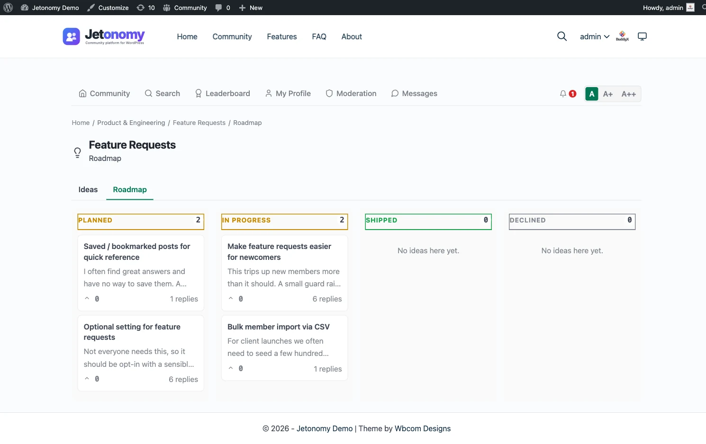

Every Ideas space includes a built-in roadmap view. Instead of scrolling through a flat list of feature requests, visitors can see all ideas organized by status - what is planned, what is being built, what has shipped, and what will not be pursued. This page explains the roadmap, the status lanes, and who is told when a status changes.

## What You Will Learn

- Where to find the roadmap view
- What the four status lanes mean
- How admins update an idea's status
- Who is notified when a status changes
- What the roadmap looks like for community members

## What the Roadmap Shows



The roadmap is a dedicated view of an Ideas space that groups all ideas by their current status. Access it at:

```
/community/s/<space-slug>/roadmap/
```

A link to the roadmap appears in the Ideas space navigation alongside the main topic list. Members do not need to navigate manually - they can switch between the idea list and the roadmap from within the space.

Each status lane shows all ideas in that state, sorted by vote score within the lane (highest votes first). This gives members a clear view of what the community wants most and where each request stands.

## Status Lanes

The roadmap has four lanes:

| Status | What it means |
|--------|--------------|
| **Planned** | The idea has been accepted and is on the roadmap. Work has not started yet. |
| **In Progress** | The team is actively building or implementing this idea. |
| **Shipped** | The idea has been completed and is now available. |
| **Declined** | The team has decided not to pursue this idea. A reply with context is recommended. |

New ideas submitted by members have no status by default. They appear in the main idea list but not in any roadmap lane until a moderator or admin assigns a status.

> **Tip:** When you decline an idea, add a reply explaining why. Members who took the time to submit and vote on an idea deserve a clear answer. Declined ideas with a closing comment are far less likely to be re-submitted repeatedly.

## How Admins Update a Status

Any space moderator or admin can change an idea's status:

1. Open the idea (the single post view).
2. Find the **Status:** row of buttons below the title: Planned, In Progress, Shipped, and Declined.
3. Click the status you want.

Each click saves immediately, and the colored pill next to the title updates. There is no save button and no way to clear a status once it is set. You can only switch to a different one.

Status is set from the idea page only. The space edit screen in wp-admin has no Posts tab, so there is no batch editing of statuses.

## How Status Changes Surface in Notifications

When an idea's status changes, Jetonomy records it and notifies the idea's author:

**Activity log** - An entry records who changed the status, and from what to what. It is for your own audit trail. It does not appear in the idea's reply thread.

**In-app notification and email** - The idea's author gets a notification, "Your idea ... is now ...", and an email if their notification settings allow it. Nobody else is notified, and no notification is sent when you change the status of your own idea.

Followers of the space are not notified, and status changes are not included in digest emails. Encourage members to check the roadmap to follow progress.

## Customer-Visible Behaviors

What members see at each stage:

- **New idea with no status assigned** - Appears in the idea list. Not shown in any roadmap lane until an admin or moderator picks a status. Vote buttons are active so members can build up signal even before the team triages.
- **Planned** - Appears in the Planned lane on the roadmap. A "Planned" badge shows on the idea card.
- **In Progress** - Moves to the In Progress lane. Badge updates. Members can see work has started.
- **Shipped** - Moves to the Shipped lane. Badge shows "Shipped." Upvote button remains available so members can react positively to the delivery.
- **Declined** - Moves to the Declined lane. Badge shows "Declined." Vote controls remain visible.

Ideas can be moved between statuses at any time. Moving a shipped idea back to In Progress (for a revision, for example) is valid and notifies the idea's author again.

## What's Next?

The roadmap is a deep-dive on the Ideas space type. To set up a space without leaving the front end, see the front-end create flow.

[Create a Space from the Front-End →](07-front-end-create-space.md)
