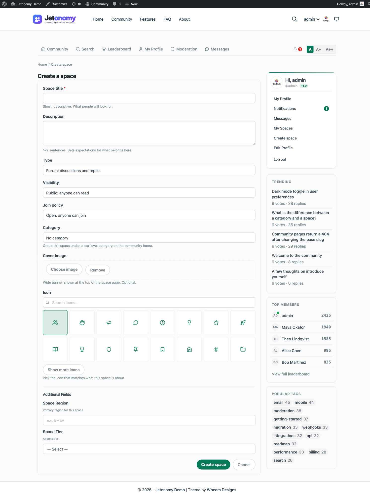

Since Jetonomy 1.4.0, members with the right role can create a new space without ever opening wp-admin. The front-end Create Space page lives at `/community/new-space/` and gives community owners a way to delegate space creation to trusted regulars, team leads, or paying members without handing out WordPress admin access.

## What You Will Learn

- Where the Create Space page lives and who can reach it
- Which roles are allowed to create spaces, and how to change that
- Every field available on the form, including the visual icon picker
- What happens the moment the form is submitted
- When to use this page versus the wp-admin equivalent

## Where The Page Lives

The page is always available at `/community/new-space/`. It is part of the standard `/community/` rewrite group, so it inherits the same theme, header, and footer as the rest of your community pages.

There is no separate menu item by default. Most communities expose the page in two places:

- A "Create space" button on `/community/` for signed-in users with permission
- A "Start a space" link in the header avatar menu

Both links are conditional. Members who do not have permission never see the link and never see the page either, even if they type the URL directly.

## Who Can Create Spaces

Open **Jetonomy → Settings → Front-end space creation**. The setting is a list of WordPress roles. Tick the roles you want to allow.

The default is Administrator only, which matches the pre-1.4.0 behaviour. Most communities widen this to Editor, Author, or a custom role such as "Community Builder" after they have run for a few weeks and identified trusted members.

A few important notes:

- The permission is role-based, not per-user. If you want to grant one specific member the ability to create spaces, add them to a role that has it.
- Granting the right to create a space is not the same as granting the right to moderate every other space. A member who can create one space only moderates the spaces they created, not the whole community.
- Network admins on multisite have the permission everywhere by default.

## The Form Fields

The front-end form covers the fields a member needs to launch a space. The slug is generated automatically from the title, and posts-per-page is set later on the Edit Space page rather than at creation time.

| Field | What it controls |
|---|---|
| Title | The display name shown in listings and the space header. Required. |
| Description | One or two sentences shown on the space card and the space header. |
| Type | Forum, Q&A, Ideas, or Feed. Cannot be changed after creation. |
| Visibility | Public, Private, or Hidden. |
| Join policy | Open, Approval Required, or Invite Only. |
| Category | Which top-level community category the space belongs to. Optional but recommended for navigation. |
| Icon | A visual icon shown next to the title everywhere the space appears. |

The form does its own validation in the browser before submission, then again on the server. Submitting with an empty title returns an inline error rather than a generic failure. The slug is derived from the title automatically and made unique by the server.

## The Visual Icon Picker

The icon field is not a free-text field. Jetonomy ships with a Lucide icon picker so every space gets a consistent, professionally-drawn icon.

The picker shows 16 default icons up front, covering the most common community space themes: users, hand, megaphone, message-circle, help-circle, lightbulb, star, rocket, book-open, award, shield, pin, bookmark, home, hash, and folder.

Click "Show more" to reveal another 8 icons for less common topics. If none of those fit, the search field at the top filters the entire Lucide catalogue by name, so typing "music" surfaces the music note icon, "camera" surfaces the camera icon, and so on.

The picker stores only the icon name, not an SVG, so the icon stays crisp at any size and automatically picks up the active theme's color tokens.

## What Happens On Submit

Submitting the form does five things in one transaction:

1. Creates the space row in `wp_jt_spaces`
2. Adds the submitting user as the space admin (`role = admin`)
3. Adds the space to the chosen category, if any
4. Flushes the relevant rewrite caches so the space URL resolves immediately
5. Redirects the user to the new space at `/community/s/<slug>/`

There is no approval queue. The space is live the moment the form is submitted. Who may reach the form at all is gated by the `jetonomy_create_spaces` capability plus the Front-end space creation roles setting, so you control space creation by role rather than by an after-the-fact approval step.

## Validation Hints

- Title is required and cannot be a duplicate of an existing space title within the same category.
- The slug is generated automatically from the title and made unique by the server. There is no slug field on the create form; you can edit the slug later from the Edit Space page.
- Description is optional but space cards look better with one.
- Category, Type, Visibility, and Join policy default to the community-wide defaults set in **Jetonomy → Settings**.

## Permission Gotchas

A few rules that surprise people on first use:

- **Creating is not moderating.** A role granted "create spaces" is automatically space admin only for the spaces it creates. It cannot moderate other spaces it did not create.
- **Visibility is per-space, not per-role.** A role allowed to create spaces can create a space of any visibility, including Hidden. There is no built-in per-visibility gate; restrict who can create spaces at all via the Front-end space creation roles setting if that matters for your community. One rule does apply to the combination, though: a Hidden space must use the Invite Only join policy. Picking Hidden with Open or Approval Required on the front-end form is rejected on save with "Hidden spaces must use the invite-only join policy" - set the join policy to Invite Only when you choose Hidden. See [Membership & Join Policies](03-membership-policies.md) for the full explanation.
- **Deactivating a member who created a space does not delete the space.** The space remains; ownership transfers to the next admin in the space, or to the site administrator if there is no other admin.
- **Slug collisions are checked across the whole site.** A member trying to create a space with a slug another space already uses will see an inline error, even if they cannot see the other space.

## Front-End Form vs wp-admin

Both paths produce identical spaces. Pick whichever is faster for the situation.

| Situation | Use front-end | Use wp-admin |
|---|---|---|
| You're a regular member with permission | Yes | Not available |
| You're an admin and already in the community | Yes, faster | Either |
| You're an admin setting up the community for the first time | Either | Either, bulk import easier |
| You want to create 10+ spaces in one session | Either | wp-admin has bulk tools |
| You want to seed a space with demo content | wp-admin | wp-admin only |
| You want to change advanced options (access rules, custom roles) | wp-admin | wp-admin only |

The front-end form covers everything a member or space owner needs. The wp-admin editor adds bulk tools and a few advanced toggles that only site administrators ever touch.

## Developer Hooks

The two controls that come up most often when customising this page:

- `jetonomy_create_spaces` (capability) - granted to roles via the Front-end space creation roles setting. A user without this capability never sees the Create Space link or page. This is the primary gate.
- `jetonomy_use_frontend_space_edit` (filter) - returns true to route both the Create and Edit space flows through the front-end UI. Default true. Return false to send these flows to wp-admin instead.

See the Developer Reference for the full signatures and examples.

## What's Next?

Once a member has created a space, they often want to tweak it. The Edit Space page lets them adjust the icon, description, join policy, and more without leaving the front-end.

[Edit a Space from the Front-End →](08-front-end-edit-space.md)
