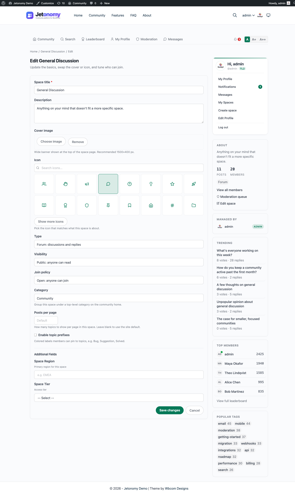

Since Jetonomy 1.4.0, space owners and moderators can edit their space directly from the front-end. They click an **Edit space** button in the space header and adjust the title, description, cover image, icon, type, visibility, join policy, category, posts-per-page, and prefixes without ever loading wp-admin.

## What You Will Learn

- Where the Edit space button appears and who sees it
- Every field you can change from the front-end
- How the cover image upload works without wp-admin permissions
- The safety rules that prevent a space from being orphaned by accident
- The difference between archiving and deleting a space
- When to use the front-end editor versus the wp-admin one

## Where The Edit Button Appears

The **Edit space** button lives in the top right of every space header, just above the post listing. It is conditional: only members with the right role inside that space see it.

The roles that see the button:

- **Space admin** - the member who created the space, plus anyone they promote to admin
- **Space moderator** - members promoted by a space admin
- **Site administrator** - sees the button in every space

Regular members and guests never see the button. If a member loses their moderator role mid-session, the button disappears on the next page load.

The button leads to a dedicated page at `/community/s/<slug>/edit/`. The URL is permission-checked on every request, so typing it directly without the right role returns a 403.

## What You Can Edit

Every space setting that is editable in wp-admin is editable from the front-end. The two editors are kept in lockstep release after release.

| Field | What it controls |
|---|---|
| Title | The display name shown everywhere the space appears |
| Slug | The URL segment under `/community/s/`. Changing it sets up a redirect from the old slug |
| Description | The one-line summary shown on the space card and header |
| Cover image | A wide banner image shown above the space header |
| Icon | The Lucide icon shown next to the title |
| Category | Which community category the space belongs to |
| Type | Forum, Q&A, Ideas, or Feed |
| Visibility | Public, Private, or Hidden |
| Join policy | Open, Approval Required, or Invite Only |
| Posts per page | A number from 1 to 100; leave blank to use the site default |
| Post prefixes | Optional tags shown in front of post titles (e.g. "Bug", "Idea") |

Changing the type after creation is supported but rarely a good idea. Switching a Q&A space to a Forum keeps every existing post but stops showing the "Mark as answer" affordance. The editor warns you before saving a type change.

## The Visual Icon Picker

The icon picker is the same one used on the Create Space page. 16 default Lucide icons up front, 8 more behind a "Show more" button, and a search field that filters the full Lucide catalogue by name.

Changing the icon takes effect immediately on save. Cached pages and listings pick up the new icon on the next refresh. There is no manual cache flush needed.

## Cover Image Upload

The cover image field accepts a standard image file. Recommended dimensions are around 1600 x 400 pixels - that is guidance for how the banner is cropped, not an enforced limit.

Uploads go into the standard WordPress media library at `/wp-content/uploads/YYYY/MM/`, the same place every other site image lives. The space stores only the resulting image URL, so the upload is reusable like any other attachment. The upload endpoint is gated by the logged-in member's edit permission in the space rather than by WordPress's `upload_files` capability, so a space owner can set a cover without site-wide media upload rights.

There is a **Remove cover** link below the upload field that clears the image reference from the space. Removing a cover only clears the reference; it does not delete the underlying attachment from the media library.

## Role-Protection Rules

The front-end editor is intentionally cautious about anything that could leave a space without an owner.

- **No self-demote.** A space admin cannot demote themselves if they are the only admin. The role dropdown skips the "moderator" and "member" options in that case and shows a tooltip explaining why.
- **No last-admin-out.** A space admin cannot delete or archive the space if they have set themselves to leave it. The flow forces a transfer-to-another-admin step first.
- **No silent ownership transfer.** Promoting another member to admin happens on the **Members** tab, not on the **Edit space** page. The editor never moves ownership in the background.

These rules exist because the most common community support ticket pre-1.4.0 was "I accidentally demoted myself and now nobody can edit the space." The front-end editor blocks that path entirely.

## Archive vs Delete

The bottom of the Edit space page has two destructive actions, kept visually separate from the save button.

**Archive space** marks the space read-only. Existing posts and replies stay visible to anyone who could see them before. New posts and replies are disabled. The space disappears from category listings but is still reachable at its original URL. Archive is reversible: re-opening the editor and clicking **Unarchive** restores everything.

Use archive when:

- A space has run its course but the content is still worth keeping
- A seasonal event ends and you want the archive of last year's discussion to remain
- A topic moves to a different space and you want the old discussions preserved

**Delete space** removes the space and every post, reply, vote, flag, and subscription in it. It cannot be undone from the UI. The button asks for explicit confirmation (typing the space title) before it fires.

Use delete when:

- The space was created by mistake and has no real content
- The content needs to be removed for legal or moderation reasons
- You are cleaning up after a spam attack

If you are unsure, archive instead of delete. Archiving is reversible; deletion is not.

## Front-End Edit vs wp-admin Edit

Both editors produce identical results. They share the same model, the same validation, and the same hooks.

| Situation | Use front-end | Use wp-admin |
|---|---|---|
| You're a space owner without admin access | Yes | Not available |
| You're a site admin already in the community | Yes, faster | Either |
| You want to change advanced access rules | Not supported | wp-admin only |
| You want to bulk-edit multiple spaces | Not supported | wp-admin only |
| You want to change Pro extensions config | Not supported | wp-admin only |
| You want to fix a typo in the description | Yes, fastest | Either |

The front-end editor covers the day-to-day fields a space owner touches. The wp-admin editor adds bulk tools and a handful of advanced settings that only site administrators ever need to change.

## What's Next?

If you give space-creation permission to a wider group, expect those members to want a single place to see every space they run or belong to. The My Spaces page does exactly that.

[My Spaces →](../user-profiles/04-my-spaces.md)
