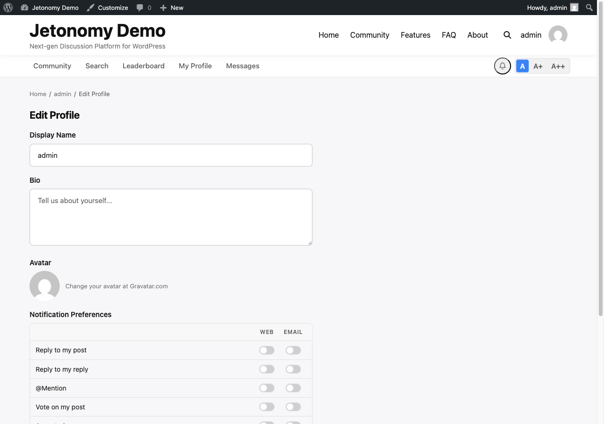
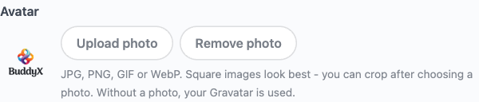

Every member in your community has a public profile page that shows who they are, how much they contribute, and what they have been up to. Profiles build trust between members and give contributors the recognition they have earned.

## What You Will Learn

- What a member profile page shows
- How online status works on profiles
- Which tabs are available and who can see each one
- How members edit their own profile
- How members delete their own account from the app or API
- Where reputation and trust level appear

## The Profile Page

Every member has a profile page at `/community/u/their-username/`. Anyone can visit this page - no login is required unless your community is set to private.


### Header Section

The profile header shows:

- **Avatar** - pulled from WordPress Gravatar by default. Members can upload a custom photo from the Edit Profile page and crop it square before it is saved.
- **Display name** - the name shown across all community activity
- **Username** - the login handle used in @mentions and the profile URL
- **Bio** - a short text description the member writes themselves
- **Join date** - when the member's account was created
- **Online status** - a green dot appears if the member was active in the last 5 minutes (see [Online Status](03-online-status.md))

### Stats Bar

Below the header, four stats appear at a glance:

| Stat | What it shows |
|------|---------------|
| Reputation | Total reputation score earned |
| Posts | Number of published topics |
| Replies | Number of published replies |
| Trust Level | Current trust level badge and name |

The trust level badge uses the same color coding as it does on reply cards - grey for TL0, scaling up to gold for TL5.

## Profile Tabs

### Posts

Lists every topic the member has published, paginated 20 per page, sorted newest first. Each item shows the topic title, the space it belongs to, the vote score, and the reply count.

### Replies

Lists every reply the member has posted across all spaces, paginated 20 per page, newest first. Each item shows the reply excerpt, the topic it belongs to, and the vote score.

### Votes

Shows the content this member has voted on. The tab is visible to the member themselves and to WordPress Administrators. Other members cannot see this tab - voting is semi-private.

### Bookmarks

Lists the topics this member has bookmarked, at `/community/u/their-username/bookmarks/`. Like Drafts, this tab appears only on the member's own profile. Bookmarks are private to the member who saved them, so no one else (including administrators viewing the public profile) sees this tab. It gives members a quick personal reading list of posts they wanted to come back to. See [Bookmarks & Following](../discussions/04-bookmarks-following.md) for how members save and manage bookmarks.

### Drafts

Shows unpublished draft topics saved by this member. This tab is visible only to the profile owner and WordPress Administrators. Drafts are never exposed publicly.

> **Tip:** Encourage active members to complete their bio. Profiles with a bio and a recognizable avatar get more replies - other members feel more comfortable engaging when they know who they are talking to.

## Editing a Profile

Members can edit their own profile at `/community/u/their-username/edit/`. This page is accessible from the **Edit Profile** button on the profile page header.



Editable fields:

- Display name
- Bio
- Avatar - upload a JPG, PNG, GIF, or WebP. After choosing a non-GIF image, a crop dialog opens: drag to reposition, use the slider to zoom, then **Crop and upload** saves a square avatar (animated GIFs upload as-is to preserve animation). The "Remove photo" button reverts to the Gravatar.
- Notification preferences (email and in-app toggles per type)



WordPress Administrators can edit any member's profile from the standard WordPress Users admin as well.

## Deleting Your Account (1.8.0+)

Members can permanently delete their own account from the mobile app or the REST API (`DELETE /users/me`). There is no web front-end button for this yet - it is available through the app and the API only.

Account deletion is permanent and cannot be undone from the community front end - make sure your app or client confirms with the member before sending the request.

## Embedding Profiles on a Page

You do not have to send members to the full profile page to surface profile information. Two shortcodes let you drop a compact member card or a space member roster onto any WordPress page, post, or widget area. Both are **shortcode-only** - there is no matching Gutenberg block, so add them with a Shortcode block or directly in the editor.

### Member profile card

```
[jetonomy_user_profile user_id="0"]
```

Renders a small card with the member's display name, trust level badge, a short bio excerpt, and their reputation and post count. Set `user_id` to a specific member's ID, or leave it as `0` (the default) to show the **currently logged-in member's** card - handy for a "your profile at a glance" panel on a members-only page.

### Space member roster

```
[jetonomy_space_members space_id="5" count="20"]
```

Lists the members of one space, ranked by reputation. Drop it on a space landing page or an "About this community" page so visitors can see who is active.

| Attribute | Default | What it does |
|-----------|---------|--------------|
| `space_id` | `0` | The ID of the space whose members to list. Required - leave it unset and nothing renders. |
| `count` | `10` | How many members to show, highest reputation first. |

> **Note:** The roster attribute is `count`, not `limit`.

## What's Next?

See how your top contributors rank against each other on the community leaderboard.

[Leaderboard →](02-leaderboard.md)

## Related Pro Features

- [Custom Badges](../pro-features/05-custom-badges.md) - award badges automatically or by hand to recognize members.
