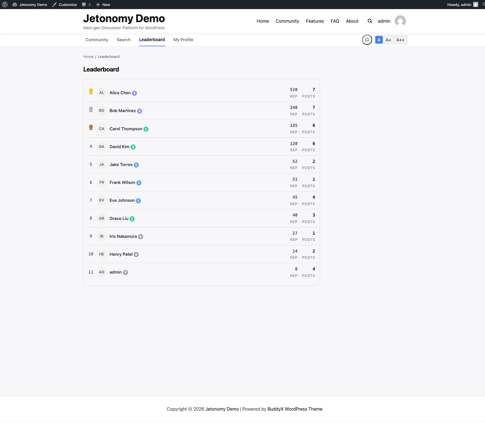

The leaderboard turns quality participation into something visible and worth competing for. Your top contributors are recognized publicly, which encourages every member to engage more thoughtfully.

## What You Will Learn

- How to find the leaderboard page
- What information is displayed for each member
- How the top 3 medal positions work
- How to add the leaderboard sidebar widget
- Why public recognition improves community quality

## The Leaderboard Page

The community leaderboard is available at `/community/leaderboard/`. Any member — and guests, if your community is public — can view it. No login is required.

Members are ranked by total reputation score, highest first. The leaderboard updates in real time as reputation changes — there is no daily cache delay between earning reputation and appearing in the rankings.

## What Each Row Shows

Every row on the leaderboard displays:

| Column | Description |
|--------|-------------|
| Rank | Position number (1, 2, 3...) |
| Avatar | Member's profile picture with online status dot |
| Name | Display name, linked to their profile page |
| Trust badge | Colored trust level badge |
| Reputation | Total reputation score |
| Posts | Total published topic count |

Clicking a member's name or avatar goes directly to their profile page.

## Top 3 Medal Positions

The first three positions on the leaderboard display a medal icon next to the rank number:

| Position | Medal |
|----------|-------|
| 1st place | Gold medal |
| 2nd place | Silver medal |
| 3rd place | Bronze medal |

Medal icons draw the eye immediately when someone opens the leaderboard page. Being in the top 3 is a genuine achievement that members notice and compete for.

## The Leaderboard Sidebar Widget

Add the **Jetonomy: Top Members** widget to any sidebar from **Appearance → Widgets**. The widget shows the top 5 members by reputation with their avatars and scores — a compact preview of the leaderboard without requiring members to visit the full page.

Configuration options:

| Option | Default | Description |
|--------|---------|-------------|
| Title | Top Members | Widget heading text |
| Count | 5 | Number of members to show (max 10) |

The widget data is cached for 5 minutes to keep database queries low on high-traffic sites.

## Why the Leaderboard Improves Community Quality

Recognition is a powerful motivator. When members see their name on the leaderboard, they are more likely to write detailed answers, respond helpfully to new members, and keep coming back. Members who are close to moving up a rank are especially motivated — the leaderboard creates natural competition without requiring badges, gamification plugins, or manual awards.

> **Tip:** Reference the leaderboard in your community welcome message or newsletter. "See who our top contributors are this month" gives members a reason to engage and something to aspire to.

## What's Next?

Learn how the online status green dot works — when it shows, where it appears, and how Jetonomy tracks it efficiently.

[Online Status →](03-online-status.md)
