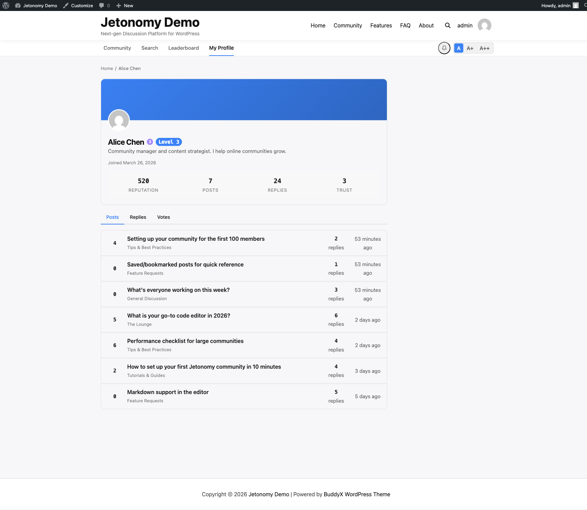

The online status green dot shows which members are currently active in your community. It makes conversations feel more live and helps members know when is a good time to expect a quick reply.

## What You Will Learn

- When the green dot appears on a member's avatar
- Where online status is displayed across the community
- Where it is intentionally not shown and why
- How Jetonomy tracks activity without overloading the database
- That no setup is needed - it works automatically

## When the Green Dot Appears

A green dot appears on a member's avatar when they have been active in the community within the last 5 minutes. Active means any authenticated page load or interaction - visiting a topic, posting a reply, casting a vote, or navigating between pages.

After 5 minutes of inactivity, the dot disappears automatically on the next page load that renders it.

There is no manual "appear offline" or "appear online" toggle. Online status reflects real activity.

## Where Online Status Appears

The green dot is shown in these locations:

| Location | Shown |
|----------|-------|
| Reply cards (author avatar) | Yes |
| Member profile page (header avatar) | Yes |
| Sidebar Leaderboard widget | No (the widget lists names and scores only, no avatars) |
| Topic listing rows (author credit) | No |
| Search results (author credit) | No |

## Why Not on Topic Listing Rows

Topic listing pages can show dozens of topics, each by a different author. Rendering the online status for every author on that page would require checking multiple records in a single request - potentially 20 to 50 lookups per page view on an active community.

Jetonomy deliberately omits the online dot from listing rows to keep those pages fast. The detail-level contexts (reply cards, profiles, widgets) are the right place for presence information because you are already focused on a specific member.

## How Activity Tracking Works

When a logged-in member loads any community page, Jetonomy records a timestamp on their user record. To prevent a database write on every single page view, updates are rate-limited: Jetonomy writes the timestamp at most once per minute per member.

If a member loads 10 pages in 30 seconds, Jetonomy writes to the database once. This keeps the `wp_jt_user_profiles` table write volume proportional to the number of unique active members, not the total number of page views.

The online status check itself (reading whether a member is active) is cached for 60 seconds using the WordPress object cache. On a page with 10 reply cards by different authors, Jetonomy makes at most a small batch of cache reads rather than 10 individual queries.

## No Setup Required

Online status is automatic. There is no setting to enable, no API key to configure, and no JavaScript polling. It works the moment Jetonomy is activated.

> **Note:** Online status is only tracked for logged-in members. Guests who browse your community are not tracked and do not show an online indicator.

## What's Next?

Go back to other sections, or return to the main community setup guide.

[User Profiles →](01-profiles.md) | [Leaderboard →](02-leaderboard.md)
