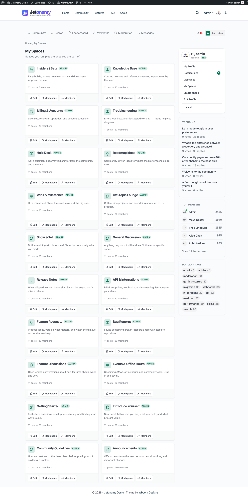

Since Jetonomy 1.4.0, every signed-in member has a personal page at `/community/my-spaces/` that lists every space they run and every space they're a member of, in one place. It is the fastest way to jump back into a space you are active in without scrolling the home page.

## What You Will Learn

- Where the My Spaces page lives and how to reach it
- The two sections shown on the page and what they mean
- What each row tells you at a glance
- Quick actions available per row
- What members see when they're brand new and have not joined any space yet
- The privacy semantics: who can see this page

## Where The Page Lives

The page is always at `/community/my-spaces/`. It is signed-in only. Visiting the URL while signed out redirects to the login page and returns to My Spaces after a successful sign-in.

There are two built-in ways to reach the page:

- The **My Spaces** link in the header avatar menu (added automatically in Jetonomy 1.4.0+)
- The mobile drawer menu under "Community"

If your theme overrides the header template, the link may not appear automatically. The page itself still works at the URL.

## The Two Sections

The page is split into two sections, stacked top to bottom.

### Spaces You Run

The first section lists every space where you are a space admin or space moderator. These are the spaces you have authority over.

For each space, the row shows:

- The space icon and title
- A role badge ("Admin" or "Mod")
- The post count and member count
- Quick action buttons: **Edit** (admins only), **Mod queue**, **Members**

The whole card is a link to the space home, so there is no separate "Visit" button.

If you run no spaces, this section simply does not appear (empty sections are hidden). If you also belong to no spaces, the page shows a single combined empty state - see [Empty State](#empty-state) below.

### Spaces You're In

The second section lists every space where you are a regular member. These are the spaces you have joined but do not moderate.

For each space, the row shows:

- The space icon and title
- An optional short description
- The post count and member count

The whole card is a link to the space home; member rows have no per-row action buttons.

If you have not joined any spaces yet, this section simply does not appear (empty sections are hidden).

## What Each Row Tells You

| Element | What it means |
|---|---|
| Icon | The Lucide icon picked by the space owner |
| Title | The space name; the whole card links to the space home |
| Role badge | "Admin" or "Mod" on the spaces you run; no badge for regular members |
| Description | An optional short description excerpt, when the space has one |
| Post count | Total published topics in the space |
| Member count | Total members in the space |

## Quick Actions

Action buttons appear only on rows in the "Spaces you run" section. Member rows have no action buttons - clicking the card opens the space.

- **Edit** appears only for spaces you administer. It opens the front-end Edit Space page covered in the previous article.
- **Mod queue** opens the space's moderation queue.
- **Members** opens the members tab where you can promote, demote, or remove members.

## Empty State

Brand-new members often land on My Spaces before they have joined anything. When you neither run nor belong to any space, the page shows a single full-page empty state - "You are not in any spaces yet" with a **Browse spaces** button that goes to the community home.

Otherwise, empty sections are simply hidden: if you run spaces but belong to none as a regular member (or vice versa), only the section with content renders. There is no per-section "collapsed" placeholder and no "Create a space" button on this page.

## Privacy

The My Spaces page is personal to the signed-in user.

- It requires sign-in. Signed-out visitors are bounced to login.
- It is excluded from search engine indexing via the `noindex, nofollow` meta tag.
- It is not visible to anyone else. There is no public URL that shows another user's space list.
- Membership in a Hidden space is shown on this page but is still not visible on the user's public profile.

If you want to see which spaces another user is in, you have to look at their public profile, which only shows public memberships.

## Performance

The page loads all of your spaces with one indexed query per role bucket (the spaces you run, and the spaces you belong to). Space rows are hydrated once each, so there is no per-row N+1 query, and the per-card role label ("Admin" / "Mod") is served from a warmed cache.

> **Note:** The page does not paginate. It loads every space you run and every space you belong to. For the typical member this is a handful of spaces; if you expect members to belong to hundreds of spaces, pagination here is a known gap rather than a shipped feature.

## What's Next?

The My Spaces page is one entry into your community life. The full profile page covers the rest of what a member does: their posts, replies, votes, bookmarks, and drafts, alongside their reputation score and trust level. (Profile badges are added by the [Custom Badges](../pro-features/05-custom-badges.md) Pro extension.)

[Your Profile Page →](01-profiles.md)
