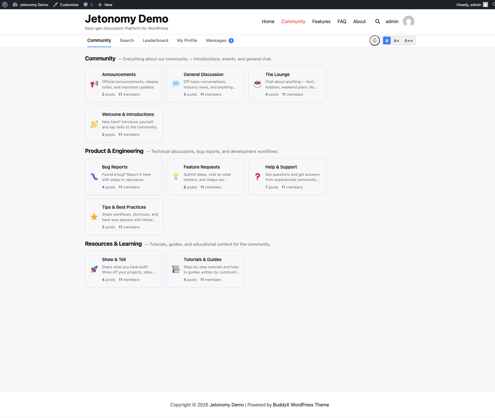

How Jetonomy compares to bbPress - and why communities are switching to a modern forum experience.

## What You Will Learn

- Key differences between Jetonomy and bbPress
- Where Jetonomy excels for growing communities
- What bbPress still does well

> **Try a live Jetonomy community before you commit** - Wbcom runs its own public support community on Jetonomy at [community.wbcomdesigns.com](https://community.wbcomdesigns.com/). Browse spaces, read real support threads, and get a feel for the voting, trust-level badges, reply threading, and moderation flow on a production site.

## Feature Comparison

| Feature | bbPress | Jetonomy |
|---------|---------|----------|
| Data storage | WordPress custom post types | Custom database tables (24 tables) |
| Threaded replies | 1 level | 3 levels |
| Voting | Not built-in (requires add-on) | Built-in upvote/downvote |
| Q&A with accepted answers | Not available | Built-in (per-space type) |
| Idea boards | Not available | Built-in with status workflow |
| Trust levels | Not available | 6-level auto-promotion system |
| Full-text search | WordPress default search | FULLTEXT index with filters |
| Real-time interactions | Page reload required | WordPress Interactivity API |
| Moderation queue | Basic | Flag system + queue + auto-rules (Pro) |
| Anti-spam | Akismet only | Akismet + reCAPTCHA + Turnstile |
| REST API | Limited | 48+ endpoints (90+ with Pro) |
| Private messaging | Not built-in | Built-in (Pro) |
| Polls | Not built-in | Built-in (Pro) |
| Analytics | Not available | Dashboard with export (Pro) |
| Migration | N/A | Built-in bbPress importer |

## Where Jetonomy Excels

### Performance at Scale

bbPress stores every topic and reply as a WordPress post. On sites with 10,000+ topics, this bloats the `wp_posts` and `wp_postmeta` tables, slowing down your entire WordPress installation - not just the forum.

Jetonomy uses its own database tables with proper indexes and cursor-based pagination. Your forum can grow to tens of thousands of topics without affecting the rest of your site.

### Self-Moderating Community

bbPress relies entirely on WordPress roles. You either trust someone to moderate or you do not. There is no middle ground.

Jetonomy's trust level system automatically promotes members as they contribute. New users start restricted. Active, helpful members gradually earn the ability to edit, moderate, and manage - without any manual role changes.

### Modern User Experience

bbPress was designed before mobile-first became standard. Jetonomy is built with responsive CSS custom properties that adapt to any theme, inline editing, instant voting, and real-time notifications - all without page reloads.

## Where bbPress Still Works

bbPress is a good choice if you need a simple, lightweight forum with minimal features and your community will stay small (under 1,000 topics). It has been around since 2011 and has a large ecosystem of third-party add-ons.

If you are already running bbPress and considering a switch, Jetonomy includes a built-in bbPress importer that migrates all your forums, topics, replies, and user data.

## What's Next?

- [Importing from bbPress](../migration/01-bbpress-import.md) - step-by-step migration guide
- [Scalability](03-scalability.md) - how Jetonomy handles large communities
