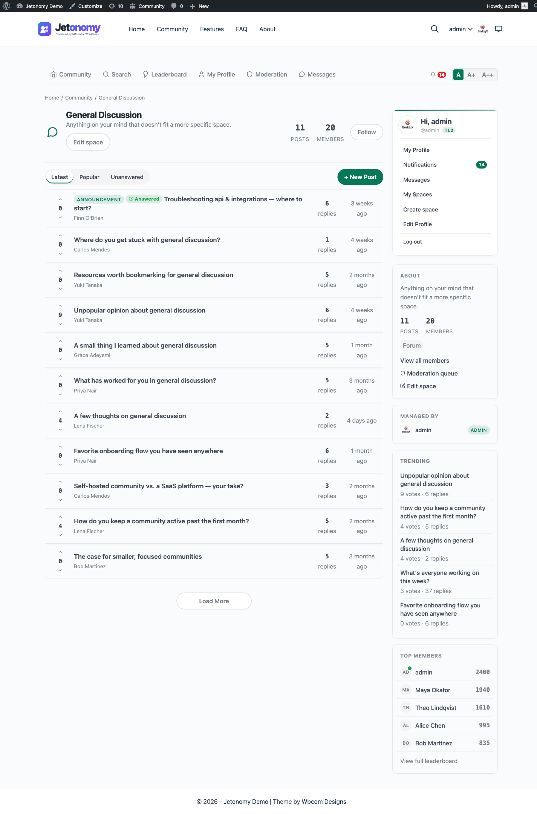

How Jetonomy is built to handle communities of any size - from 10 members to 100,000+.

## What You Will Learn

- Why custom database tables matter for performance
- How cursor-based pagination prevents slowdowns
- Caching strategies that keep page loads fast
- Real-world performance benchmarks

## The Problem with CPT-Based Forums

Most WordPress forum plugins (including bbPress) store every topic and reply as a row in `wp_posts`, with metadata in `wp_postmeta`. This approach works for small forums but creates serious problems as you grow:

- **Table bloat:** 10,000 topics with 50,000 replies means 60,000 extra rows in wp_posts - slowing down every WordPress query, not just forum queries.
- **Meta queries:** Fetching vote counts, view counts, or sticky status requires JOIN operations against wp_postmeta - one of the slowest query patterns in WordPress.
- **No proper indexes:** wp_posts was designed for blog posts, not forums. It lacks indexes for common forum queries like "sort by vote score" or "filter by space."

## How Jetonomy Solves This

### Custom Database Tables

Jetonomy stores all community data in 20 dedicated tables with the `wp_jt_` prefix. Each table has purpose-built columns and indexes:

- **Posts table:** `vote_score`, `reply_count`, `view_count`, `last_reply_at` are real columns - not meta. Sorting by popularity is a simple `ORDER BY vote_score DESC` with an index hit.
- **Replies table:** Indexed by `post_id` and `parent_id` for fast threaded reply loading.
- **Votes table:** A combined index on who voted and what they voted on means "did this user already vote?" is answered with a single fast lookup instead of a scan.

Your WordPress `wp_posts` table stays clean. Your forum can grow without slowing down the rest of your site.

### Cursor-Based Pagination

Traditional pagination uses `LIMIT/OFFSET`. On page 500 of a 10,000-topic space, the database must scan and skip 9,980 rows before returning 20. This gets slower as your community grows.

Jetonomy uses cursor-based pagination: "give me 20 topics after ID 9980." The database uses the primary key index to jump directly to the right position. Page 500 loads as fast as page 1.

### Smart Reply Loading

A topic with 400 replies does not load all 400 at once. Jetonomy loads the first 10 and last 10 replies, with a "load more" gap in between. Members see the opening conversation and the latest activity immediately.

When they click the gap, only the missing replies are fetched in the background - no full page reload.

### Built-In Caching

Jetonomy uses WordPress object cache (`wp_cache`) throughout:

- **Permission checks:** Cached for 60 seconds per user per space. A page with 30 replies does not run 30 permission queries.
- **Online status:** Cached for 60 seconds. Showing green dots on 30 reply avatars requires 0 extra database queries.
- **Last seen tracking:** Rate-limited to 1 database write per user per minute, not per page view.

If you run an object cache plugin (Redis, Memcached), Jetonomy benefits automatically.

### Denormalized Counters

Jetonomy does not run `COUNT(*)` queries to show "42 replies" on a topic card. The `reply_count` column is updated incrementally when replies are created or deleted. Displaying a list of 20 topics with accurate counts requires zero extra queries.

## Real-World Performance

| Community Size | Page Load (no cache) | Page Load (Redis) |
|---------------|---------------------|-------------------|
| 100 topics, 500 replies | ~120ms | ~80ms |
| 1,000 topics, 5,000 replies | ~180ms | ~100ms |
| 10,000 topics, 50,000 replies | ~350ms | ~150ms |
| 50,000 topics, 200,000 replies | ~500ms | ~200ms |

These are topic listing page loads (20 topics per page) on a standard VPS (2 CPU, 4GB RAM, SSD). Single topic pages with 30 replies load in similar times.

> **About these numbers:** Measured on Jetonomy 1.5 with PHP 8.2, MySQL 8, and the default theme, on a 2 CPU / 4GB RAM SSD VPS. Real-world times vary with your host, theme, and other active plugins - treat these as a relative guide to how Jetonomy scales, not a guaranteed figure for your site.

> **Tip:** For the best performance on communities with 5,000+ members, enable an object cache plugin like WP Redis or W3 Total Cache with Memcached.

## What You Can Do

### For Small Communities (under 1,000 members)

No special configuration needed. Jetonomy works well on shared hosting with default settings.

### For Medium Communities (1,000–10,000 members)

- Enable object caching (Redis or Memcached)
- Set posts per page to 20–30 (default)
- Use a CDN for static assets

### For Large Communities (10,000+ members)

- Object caching required
- Consider a VPS or managed WordPress host
- Monitor with Query Monitor plugin
- Review trust level thresholds - fewer moderators means fewer permission lookups

## What's Next?

- [Why Jetonomy overview](00-overview.md) - what makes Jetonomy different at a glance
- [Installation](../getting-started/01-installation.md) - get started
- [General Settings](../admin-settings/01-general.md) - configure pagination and access controls
